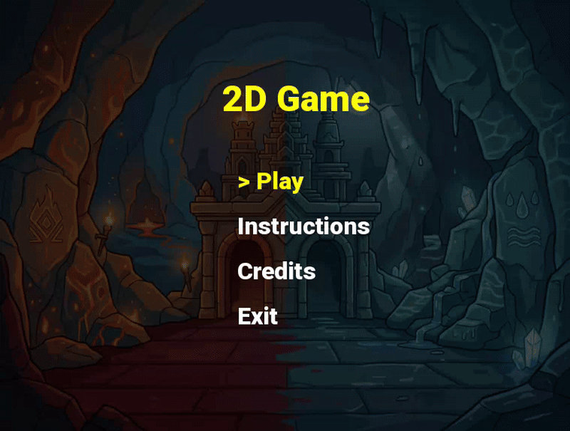

# Flame & Bone

A 2D cooperative puzzle-platformer inspired by games such as Fireboy and Watergirl. Two characters with different elemental properties must work together, navigate hazards, activate mechanisms, and reach the exit.

## Gameplay preview



## Features

- Two-player cooperative gameplay
- Puzzle-solving and level exploration
- Buttons, doors, hazards, and other interactions
- Multiple levels with varying difficulty
- Physics-based movement and jumping
- Level progression and save system
- Background music and sound effects

## How to play
 
Each player can only collect their own color of gem and pass through their own hazards and door.
Collect **all** gems, then have both players stand at their doors at the same time to clear the level.
Step on buttons to activate button-controlled platforms. Touching the wrong hazard — ends the run.

## Controls

| Action | Player 1 (Red) | Player 2 (Blue) |
|---|---|---|
| Move | `A` / `D` | `←` / `→` |
| Jump | `W` | `↑` |
 
| Menu action | Key |
|---|---|
| Navigate menus | `↑` / `↓` |
| Confirm / select | `Enter` |
| Pause | `Esc` |


## Building from source & running
 
```bash
git clone <repo-url>
cd 2Dgame
cmake -B build -DCMAKE_BUILD_TYPE=Release
cmake --build build
cd build && make run
```
 
Levels are plain text grids (`assets/mapN.txt`); each character maps to a tile, hazard, gem, door,
button, or spawn point — see `Game::loadMap()` for the legend.

## Technologies

- C++17 — primary programming language
- SFML 2.6.1 — graphics, window management, input, audio, and other game functionality
- CMake — cross-platform build system

## Credits
 
Game design & programming:
- Faustas Alekna
- Gustas Juskevicius

Made with C++ and SFML.